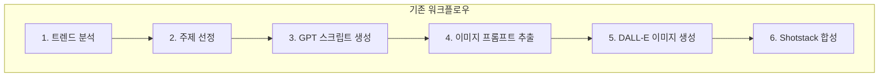
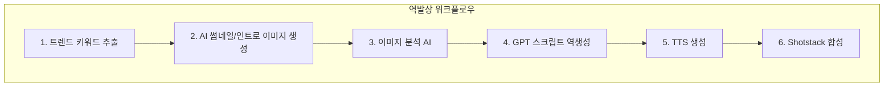
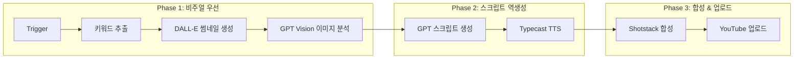

# Phase 2 리서치 보고서: 줌 효과 및 역발상 워크플로우

> **작성일**: 2026-01-02
> **목적**: Shotstack 줌 효과 적용 가능성 분석 + 역발상 워크플로우 시각화

---

## 1. 🔍 Shotstack 줌 효과 딥리서칭 결과

### 1.1 결론 요약

| 기능 | 지원 여부 | 적용 난이도 |
|------|----------|------------|
| **zoom 트랜지션** (in/out) | ✅ 지원 | 🟢 쉬움 |
| **scale Tween** (확대/축소 애니메이션) | ❌ 미지원 | - |
| **Ken Burns 효과** (팬+줌) | ⚠️ 부분 지원 | 🟡 중간 |

### 1.2 zoom 트랜지션 (즉시 적용 가능!)

Shotstack은 클립별 `transition` 속성에서 **zoom** 효과를 지원합니다:

```json
{
  "transition": {
    "in": "zoom",      // 줌인 등장
    "out": "fade"      // 페이드 아웃 퇴장
  }
}
```

**지원되는 zoom 옵션:**
| 옵션 | 효과 | 속도 |
|------|------|------|
| `zoom` | 빠른 줌인 | 기본 |
| `zoomFast` | 더 빠른 줌인 | 빠름 |
| `zoomSlow` | 느린 줌인 | 느림 |

**적용 방법:**
- `in`: 클립 시작 시 효과
- `out`: 클립 종료 시 효과

### 1.3 Tween 프레임워크 (고급 애니메이션)

Shotstack Tween은 다음 속성만 지원합니다:

| 속성 | 설명 | scale 관련 |
|------|------|-----------|
| **opacity** | 투명도 애니메이션 | ❌ |
| **offset** | x, y 위치 이동 | ❌ |
| **rotation** | 회전 애니메이션 | ❌ |
| **skew** | 기울기 효과 | ❌ |
| **volume** | 오디오 볼륨 | ❌ |

> ⚠️ **scale(확대/축소)은 Tween에서 직접 지원되지 않습니다!**

### 1.4 Ken Burns 효과 대안

Ken Burns 효과(이미지에서 천천히 팬+줌)는 **offset Tween**으로 부분 구현 가능:

```json
{
  "offset": {
    "x": [{ "from": -0.1, "to": 0.1, "start": 0, "length": 5 }],
    "y": [{ "from": 0, "to": 0.05, "start": 0, "length": 5 }]
  }
}
```

- ✅ **팬(이동)**: 가능
- ❌ **줌(확대)**: 불가능

---

## 2. ✅ 즉시 적용 가능한 줌 효과

### 2.1 v18.1 업그레이드 제안

현재 v18.0 코드에 `transition` 속성 추가:

```javascript
// 현재 (v18.0)
visualClips.push({ 
    asset: { type: "image", src }, 
    start: INTRO_LEN + (i * perSegmentTime), 
    length: perSegmentTime, 
    fit: "cover" 
});

// 고도화 (v18.1)
visualClips.push({ 
    asset: { type: "image", src }, 
    start: INTRO_LEN + (i * perSegmentTime), 
    length: perSegmentTime, 
    fit: "cover",
    transition: {
        in: i === 0 ? "zoom" : "fade",  // 첫 이미지만 줌인
        out: "fade"
    }
});
```

### 2.2 후킹 강화 줌 패턴

| 슬라이드 | in 효과 | out 효과 | 목적 |
|----------|---------|----------|------|
| 1 (후킹) | **zoomFast** | fade | 강렬한 첫인상 |
| 2-5 (서사) | fade | fade | 안정적 전환 |
| 6 (CTA) | **zoom** | fade | 마무리 강조 |

---

## 3. 🔄 역발상 워크플로우 n8n 구조 시각화

### 3.1 기존 vs 역발상 비교





### 3.2 역발상 워크플로우 상세 구조



### 3.3 n8n 노드 구성 (역발상)

```
┌─────────────────────────────────────────────────────────────────┐
│                    역발상 워크플로우 n8n 구조                     │
├─────────────────────────────────────────────────────────────────┤
│                                                                 │
│  [1. Schedule Trigger]                                          │
│         ↓                                                       │
│  [2. HTTP: 트렌드 키워드 API] ← YouTube Data API / Google Trends │
│         ↓                                                       │
│  [3. Code: 키워드 필터링]                                        │
│         ↓                                                       │
│  ┌─────────────────────────────────────────────────────────────┐│
│  │ [4. DALL-E: 썸네일 이미지 생성] ← 키워드 기반 프롬프트      ││
│  │         ↓                                                   ││
│  │ [5. GPT Vision: 이미지 분석] ← "이 이미지를 설명해줘"       ││
│  └─────────────────────────────────────────────────────────────┘│
│         ↓                                                       │
│  [6. GPT: 스크립트 역생성] ← 이미지 설명 + 키워드 기반          │
│         ↓                                                       │
│  [7. Split: 스크립트 → 문장 분리]                               │
│         ↓                                                       │
│  [8. DALL-E x6: 본문 이미지 생성] ← 각 문장별 프롬프트          │
│         ↓                                                       │
│  [9. Merge: 이미지 병합]                                        │
│         ↓                                                       │
│  [10. Typecast TTS]                                             │
│         ↓                                                       │
│  [11. Code: Shotstack JSON Builder]                             │
│         ↓                                                       │
│  [12. HTTP: Shotstack Render]                                   │
│         ↓                                                       │
│  [13. Wait + Polling]                                           │
│         ↓                                                       │
│  [14. YouTube Upload]                                           │
│                                                                 │
└─────────────────────────────────────────────────────────────────┘
```

### 3.4 핵심 변경 노드

| 기존 노드 | 역발상 노드 | 변경 내용 |
|----------|-----------|----------|
| GPT 스크립트 (먼저) | GPT Vision (먼저) | 이미지 분석 후 스크립트 |
| DALL-E (나중) | DALL-E (먼저) | 썸네일부터 생성 |
| 고정 프롬프트 | 키워드 기반 동적 | 트렌드 연동 |

### 3.5 역발상의 장점

| 장점 | 설명 |
|------|------|
| **CTR 최적화** | 가장 자극적인 썸네일 먼저 확정 |
| **일관성** | 이미지에 맞는 스크립트 = 불일치 방지 |
| **저작권 안전** | 모든 이미지 AI 생성 |
| **트렌드 반영** | 실시간 키워드 연동 |

---

## 4. 📋 액션 플랜

### 즉시 적용 (v18.1)
1. [ ] `transition: { in: "zoom" }` 코드 추가
2. [ ] 첫 번째 이미지에 `zoomFast` 적용
3. [ ] 마지막 이미지에 `zoom` 적용

### Phase 2 (역발상 워크플로우)
4. [ ] YouTube Data API 노드 추가
5. [ ] GPT Vision 노드 추가
6. [ ] 워크플로우 순서 재구성
7. [ ] 테스트 및 검증

---

## 5. 🎯 결론

| 항목 | 결론 |
|------|------|
| **줌 트랜지션** | ✅ 즉시 적용 가능 (v18.1) |
| **scale Tween** | ❌ 미지원 (대안: offset 팬 효과) |
| **역발상 워크플로우** | ⚠️ n8n 구조 대폭 변경 필요 |

**권장**: 
1. 먼저 v18.1로 `zoom` 트랜지션 적용
2. 효과 확인 후 역발상 워크플로우 단계적 도입
